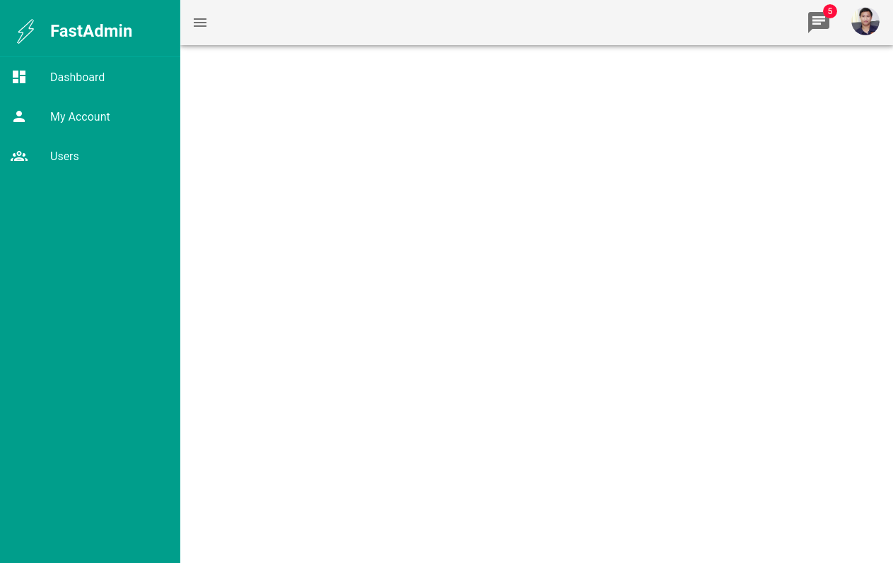

# FastAdmin

FastAdmin is a fullstack skeleton project for build admin dashboard wil most features and strong tools based on FastAPI & VueJS.

**Dashboard**



## Quickstart

**Setup environment**

```shell
# Create python virtual environment
virtualenv -p python3.7 venv-py3.7
source venv-py3.7/bin/activate
pip install -r requirements.in

# Run FastAdmin
uvicorn App.main:app --reload --port 8009
```

## Development


Create a new model and migrations

```shell
cd App

# Create new model
orator make:model Post -m

# run migrate
orator migrate -c Database/db.py

# rollbacke migration
orator migrate:rollback -c Database/db.py

# Refresh
orator migrate:refresh --seed -c Database/db.py
```

Seeding fake data

```shell
export PYTHONPATH="<project_path>/FastAdmin"
orator db:seed --seeder users_table_seeder -c Database/db.py
```